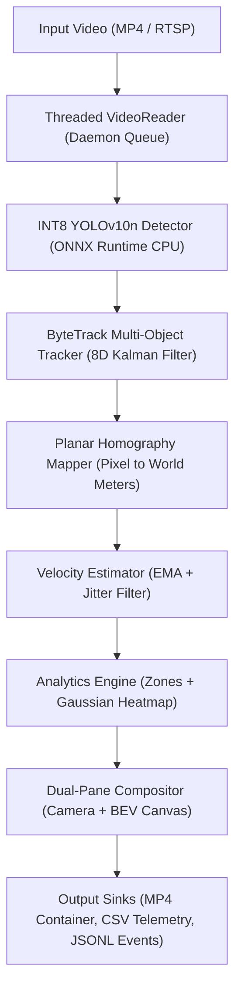

# SpatialTrack

[](https://github.com/PatelDeepB/spatialtrack/actions)
[](https://github.com/PatelDeepB/spatialtrack)
[](https://www.python.org/)
[](https://opensource.org/licenses/MIT)
[](https://github.com/astral-sh/ruff)
[](https://mypy-lang.org/)
[-success.svg)](#)

> **CPU-Optimized Spatial Telemetry, Multi-Object Tracking, and Metric Speed Estimation Engine.**

SpatialTrack transforms commodity camera video streams into calibrated real-world spatial intelligence without requiring expensive GPU infrastructure ($0 hardware budget).

---

## Key Features

- **Strict CPU Optimization:** Runs at 12 to 15+ FPS on standard laptop CPUs using dynamic INT8 ONNX static-weight quantization (2.65 MB model footprint).
- **Persistent Multi-Object Tracking:** ByteTrack two-stage bipartite association with an 8D constant-velocity Kalman filter, maintaining ID persistence through occlusions.
- **Metric Ground Homography:** 4-point planar perspective transformation projecting 2D camera pixels into physical ground coordinates (meters).
- **Metric Speed Estimation:** Instantaneous velocity derivation in km/h and m/s with Exponential Moving Average (EMA) smoothing and micro-jitter deadband suppression.
- **Polygonal Zone Monitoring:** Geofenced polygonal boundaries with point-in-polygon containment, tracking zone entry, exit, and dwell times.
- **Spatial Traffic Heatmaps:** 2D Gaussian density kernel accumulator mapping vehicle congestion hotspots onto Bird's-Eye-View (BEV) road canvases.
- **Synchronized Dual-Pane Visualization:** Real-time camera perspective on the left, orthographic BEV road canvas on the right, and live telemetry banners.
- **Structured Data Export:** Automated streaming sinks for MP4 video containers, per-frame CSV telemetry, and JSON Lines (`.jsonl`) security events.
- **Interactive Streamlit Web UI:** Browser application with video upload, slider controls, and export downloads.

---

## Architecture



---

## CPU Benchmark Performance

Standardized benchmark measured across an Intel Core i7 mobile CPU (2 intra-op threads) on 720p resolution video:

| Pipeline Stage | Mean Latency | P95 Latency | Min Latency | Max Latency |
|:---------------|:------------:|:-----------:|:-----------:|:-----------:|
| **Inference (INT8 ONNX)** | **71.81 ms** | 75.18 ms | 68.03 ms | 94.06 ms |
| **Tracking (ByteTrack)** | **0.46 ms** | 0.68 ms | 0.15 ms | 0.78 ms |
| **Projection & Speed** | **0.21 ms** | 0.41 ms | 0.00 ms | 0.74 ms |
| **Visualization & Heatmap** | **7.58 ms** | 10.91 ms | 4.16 ms | 25.18 ms |
| **Total Pipeline** | **80.07 ms** | **87.18 ms** | **72.34 ms** | **120.76 ms** |

**Aggregate Throughput:** **12.5 FPS** (CPU-only, zero GPU required).

---

## Quick Start (3 Steps)

### 1. Installation
```bash
git clone https://github.com/PatelDeepB/spatialtrack.git
cd spatialtrack
pip install -e ".[app]"
```

### 2. Download Model Weights
```bash
python scripts/download_model.py
```
This downloads YOLOv10n and applies dynamic INT8 quantization, saving `models/yolov10n_int8.onnx` (2.65 MB).

### 3. Run Pipeline
```bash
spatialtrack run \
  --source app/assets/sample_traffic.mp4 \
  --calibration app/assets/sample_calibration.json \
  --output output.mp4 \
  --export-csv telemetry.csv \
  --export-events events.jsonl \
  --heatmap
```

---

## CLI Reference

SpatialTrack provides a modular CLI built with Typer:

| Command | Description | Example |
|:--------|:------------|:--------|
| `spatialtrack run` | Run end-to-end engine with all sinks | `spatialtrack run --source clip.mp4 --calibration cal.json` |
| `spatialtrack telemetry` | Dual-pane BEV view and speed estimation | `spatialtrack telemetry --source clip.mp4 --show` |
| `spatialtrack detect` | Object detection only | `spatialtrack detect --source clip.mp4 --conf 0.3` |
| `spatialtrack track` | Detection + ByteTrack tracking trails | `spatialtrack track --source clip.mp4 --show` |
| `spatialtrack calibrate` | Interactive 4-point homography calibration | `spatialtrack calibrate --source clip.mp4 --output cal.json` |
| `spatialtrack benchmark` | Run CPU latency benchmark | `spatialtrack benchmark --source clip.mp4 --threads 4` |
| `spatialtrack version` | Print current package version | `spatialtrack version` |

---

## Interactive Web Demo (Streamlit)

Launch the interactive web application locally:

```bash
streamlit run app/streamlit_app.py
```

The web UI allows you to:
1. Select between the pre-configured traffic demo clip or upload your own MP4 video.
2. Interactively tweak detection confidence, CPU execution threads, speed limits, and heatmaps.
3. Watch the real-time synchronized dual-pane feed and live KPI metric cards.
4. Download the generated MP4 video, telemetry CSV file, and JSONL event log.

---

## Docker Deployment (Hugging Face Spaces)

SpatialTrack includes a production-grade multi-stage Dockerfile ready for free deployment on Hugging Face Spaces:

```bash
# Build Docker image
docker build -t spatialtrack:latest .

# Run container
docker run -p 7860:7860 spatialtrack:latest
```

Navigate to `http://localhost:7860` to access the application.

---

## Documentation

- [Camera Calibration Guide](docs/calibration_guide.md): Illustrated guide for setting up 4-point planar homography.
- [Architecture & Mathematical Foundations](docs/architecture.md): Derivation of Kalman filter state vectors, Hungarian bipartite cost matrices, and EMA velocity smoothing.
- [Contributing Guidelines](CONTRIBUTING.md): Code quality rules, testing standards, and pull request procedures.
- [Changelog](CHANGELOG.md): History of all features, enhancements, and releases.

---

## License

This project is licensed under the [MIT License](LICENSE).
